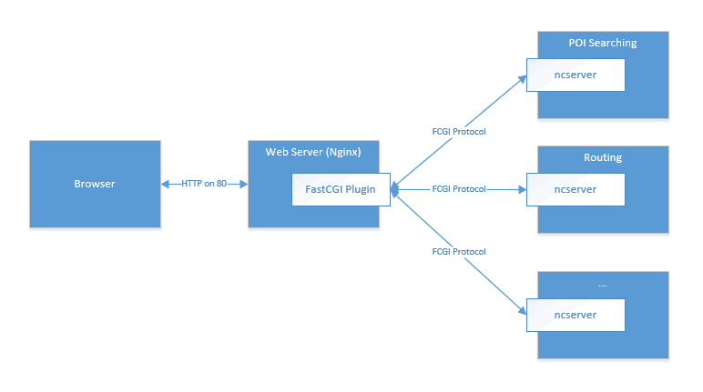

A Serious C++ HTTP Service Framework
====================================

`中文 <docs/README.chs.rst>`__ | English

**ncserver** is a C++ HTTP service framework based on FastCGI.
In NavInfo, all our navigation related services(routing, poi searching, traffic information etc) are based on this framework.

Background Introduction
-----------------------

**ncserver** is developed based on `fastcgi lib<http://fastcgi.com/>`__.

FastCGI is a common gateway interface which is already supported in so many web servers, nginx for example.
Any backend server program speaking FastCGI can communicate with web servers, and therefore can process HTTP requests easily.
With the help of FastCGI, we are able to develop C/C++ web applications, leaving more technical details to the web servers,
and we can then just focus on business logics.

However, FastCGI was originaly designed to be compatible with CGI and therefore its intefaces are not handy enough.
And that is the exact reason we develop **ncserver** to make web application development easier.

The main purposes of NcServer are:

#. to hide FastCGI details, provide more handy interfaces;
#. to provide a common web application framework and life cycle managing abilility;
#. to support user-controllable process spawning;
#. to provide a robust architecture.

The reason we support user-controllable process spawning rather than make use of spawn-fcgi's spawning abilility is
that when processes need to load large static data into memory, using spawn-fcgi's architecture would load data into
memory for every process. However, with our framework, it is allowed to fork processes after data loading, and 
therefore thanks for the copy-on-write(COW) technology, memory consumption could be reduced quite a lot.

A Simple Example
----------------

This example program (in folder "example") shows the basic function of ncserver.

.. code-block:: cpp

   // An example program of ncserver
   #include <stdlib.h>
   #include "ncserver.h"

   using namespace std;
   using namespace ncserver;

   class EchoServer : public NcServer
   {
   protected:
      virtual void query(ServiceIo* io, Request *request)
      {
         io->addHeaderField("Content-Type: text/plain; charset=utf-8");
         io->endHeaderField();

         // output request parameters
         io->print("Request-Method: %s\n", request->requestMethod());

         // parse and output query string
         io->print("Query String: %s\n", request->queryString());
         RequestParameterIterator* iter = request->getParameterIterator();
         while (iter->next())
         {
            io->print("%s: %s\n", iter->name, iter->value);
         }

         // read POST data
         if (request->isPost())
         {
            unsigned char *buffer = new unsigned char[request->contentLength()];

            io->read(buffer, request->contentLength());
            io->write(buffer, request->contentLength());
         }
         io->flush();
      }
   };

   int main(int argc, char* argv[])
   {
      EchoServer server;
      server.runAndFork(9009);
      return 0;
   }

Test the program::

   $ curl -I "http://127.0.0.1/echo?city=beijing&keyword=coffee"
   HTTP/1.1 200 OK
   Server: nginx/1.7.2
   Date: Tue, 16 Jul 2019 04:07:09 GMT
   Content-Type: text/plain; charset=utf-8
   Connection: keep-alive

   $ curl  "http://127.0.0.1/echo?city=beijing&keyword=coffee"
   Request-Method: GET
   Query String: city=beijing&keyword=coffee
   city: beijing
   keyword: coffee

Features
--------

In addition to having a low learning curve, ncserver also provide the following benefits:

1. Multi-process architecture
   
   With multi-process architecture. Each process is isolated. 
   Even if one process crashed, the following requests will not be affected.

   With the help of the COW(copy-on-write) feature of Linux system, all work processes
   can share static memory data. So more workers don't necessarily means more memory consumption.

2. Automatically re-spawn of worker processes
   
   A daemon process will keep watching on all worker processes.
   If one worker process crashed, a new worker process will be spawned.

3. No-down-time reload
   
   If the configuration file or data file changes, the service can be reloaded with no down-time.

What's Included
---------------

* **Source Code**: Can be compiled into a static library or added to a project directly.
* **Service Control Program**: `ncserverctl`.
* **A Example Project**: See "example" folder.
* **Nginx for Windows**: For debugging under Windows. In "dependency" folder.
  
Build and Test
--------------

`ncserver` supports both Linux and Windows.

* Linux is used in production environment.
* Windows is used solely for coding and debugging. It's single processed and doesn't provide all the benefits of ncserver.
  But we think Visual Studio is indispensable for any productive-minded C++ developer.
  So we finish most of the work on Windows and only compile and deploy service on Linux.

Compile & test steps under Windows
^^^^^^^^^^^^^^^^^^^^^^^^^^^^^^^^^^

1. Configure dependency/nginx-1.7.2/conf/nginx.conf to make nginx a FastCGI proxy and transfer requests via TCP connection to our backend.

.. code-block:: bash

      location ~ /echo {
            root           html;
            fastcgi_pass   127.0.0.1:9009;
            fastcgi_index  index.php;
            fastcgi_param  SCRIPT_FILENAME  /scripts$fastcgi_script_name;
            include        fastcgi_params;
         }

.. note:: ncserver communicate with nginx with FCGI protocol. The commmunication can either be built via TCP or Unix Domain Socket.
   In this case, since we are under Windows platform, TCP becomes our only choice, and we chose 9009 port for example.
   In the case below where we introduces configuration under Linux, Unix Domain Socket will be used.

2. Double click dependency/nginx-1.7.2/nginx.exe to start nginx.

.. note:: 
   Nginx would run in background. 
   If you modify the configuration of nginx and want the new configuration to take effect, you should use the ``nginx -s reload`` command.
   If you want to stop nginx, you can either use ``nginx -s stop`` command or directly kill the nginx processes in Task Manager.

.. warning:: 
   If you double click nginx more than once, ``nginx -s stop`` command can only be used to stop the nginx processes you started by the last double click.
   Other processes can only be killed in Task Manager.         

3. Double click config/ncserver.sln, compile it in Visual Studio, and then run the example project.
4. Run example/test.py, or directly access http://127.0.0.1/echo?text=abc in browser to test the project.

Compile & test steps under Linux
^^^^^^^^^^^^^^^^^^^^^^^^^^^^^^^^

1. Install nginx using apt-get or yum (depend on your system). 
2. Configure nginx as a fastcgi proxy to transfer requests to our backend via Unix Domain Socket。

.. code-block:: bash

   $ sudo vim /etc/nginx/conf.d/default.conf

   location ~ /echo {
      root           html;
      fastcgi_pass   unix:/etc/ncserver/echo/.ncserver.sock;
      fastcgi_index  index.php;
      fastcgi_param  SCRIPT_FILENAME  /scripts$fastcgi_script_name;
      include        fastcgi_params;
   }

   $ sudo nginx -s reload(or sudo nginx -s start, if nginx is not started yet.)

3. Run the following commands to compile ncserver library and the testing program.

.. code-block:: bash

   $ python make.py
   $ mkdir /etc/ncserver/echo
   $ cp lib/echo /etc/ncserver/echo
   $ ncserverctl start echo
   Starting <echo> on domain socket unix:/etc/ncserver/echo/.ncserver.sock
   spawn-fcgi: child spawned successfully: PID: 32592

4. Use curl to test the echo server.

.. code-block:: bash

   $ curl "http://127.0.0.1/echo?city=beijing&keyword=coffee"
   Request-Method: GET
   Query String: city=beijing&keyword=coffee
   city: beijing
   keyword: coffee

Configuration
^^^^^^^^^^^^^

Each service has a configuration file named ".ncserver.yaml". 
The format of the file is as below.

.. code-block:: yaml

   server:
      # worker process count, default as 4
      workerCount: 8

You can either modify the configuration as needed before starting the service or modify it when the service is on running.
In the second case, you should run ``ncserverctl reload SERVICE_NAME`` to make it take effect.

ncserverctl
-----------

`ncserverctl` is a managment tool for ncserver services. It's used to start/stop/restart/reload a service.

System Requirement
^^^^^^^^^^^^^^^^^^

Linux system with Python 2.7 (2.7.9 or above). 
And it's recommended that you make a link of the ncserverctl file under '/usr/local/bin', and then you can run ``ncserverctl`` command anywhere.

Deploy Requirement
^^^^^^^^^^^^^^^^^^

1. All corresponding files of the service should be put inside a seperate folder under the directory specified by the ``g_default_server_dir`` variable in the ncserverctl script.
   By default, ``g_default_server_dir`` is '/etc/ncserver'.

   For example, if you have a service which does map matching, you should put all corresponding files of the service into '/etc/ncserver/map-matching-server'.

2. The files in each folder must obey the following rules:
   
   a. The name of the executable file MUST be the same as the folder itself.
   b. The name of the configuration file is recommended to be the same as the folder itself as well.
   c. Each service should contain a test script named "test.py" if you want to use the ``test`` subcommand of the ``ncserverctl`` command.

   For example::
   
         $ cd /etc/ncserver/echo-server
         $ ls
         echo-server      // the executable
         echo-server.ini  // the configuration file
         test.py          // server's test file
         .ncserver.yaml   // configuration file of the framework

Functions
^^^^^^^^^

You can run ``ncserverctl -h`` to see detailed help information of the tool.

In brief, you can run ncserverctl as below::

   $ ncserverctl start echo-server
   $ ncserverctl reload echo-server
   $ ncserverctl status echo-server
   $ ncserverctl test echo-server
   $ ncserverctl stop echo-server
   $ ncserverctl forcekill echo-server

Troubleshoot
------------

502 Bad Gateway
^^^^^^^^^^^^^^^

大量并发的时候，可能会有部分502错误。ab -n 100000 -c 200，200并发就发生了。
而100并发没有这个问题。观察nginx日志，会看到::

   2016/01/29 18:10:43 [error] 3059#0: *9190789 connect() to unix:/tmp/nds-tile-server.sock failed (11: Resource temporarily unavailable) while connecting to upstream, client: 192.168.85.22, server: fastcgi.mapbar.com, request: "GET /get/qvf?key=1156125669&fields=gridId,gridData HTTP/1.1", upstream: "fastcgi://unix:/tmp/nds-tile-server.sock:", host: "192.168.0.86"

是nginx无法和ncserver通过unix端口建立联系。

最后发现是spawn-fcgi -b backlog 参数的问题。改为512，就可以承受256并发了。
原来，请求会在unix domain socket上排队。要承受高并发，必须修改这个排队的限制数。

另外，某些CPU bound的服务，比如算路，应用以上修改后，依然有问题。
采用以下方法可以解决:

1. `sysctl -A`，检查net.core.somaxconn、net.core.netdev_max_backlog和net.ipv4.tcp_max_syn_backlog。
2. vim /etc/sysctl.conf可以修改这几个参数。`sysctl -p`应用。

如果问题还没解决，可以试试：（按理说应该不需要改这个）

1. ulimit -a，查看open files
2. 修改 /etc/security/limits.conf，加入:

   * soft nofile 1000000
   * hard nofile 1000000
